# CHILDCARE
  

- Description  
> Cross-platform application for real time baby emotion detection.   

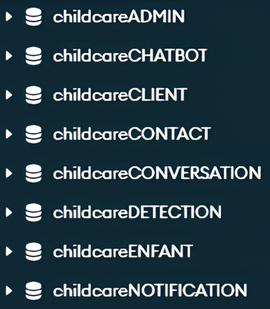
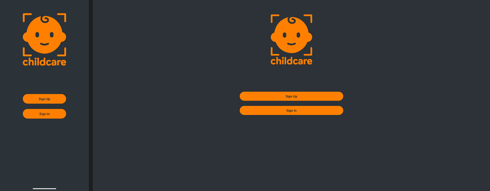
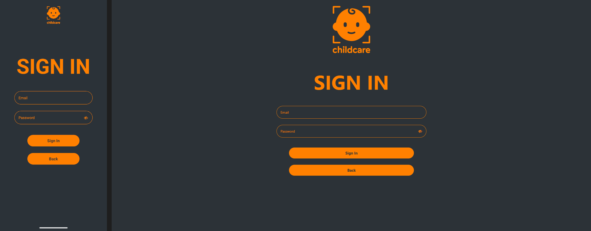
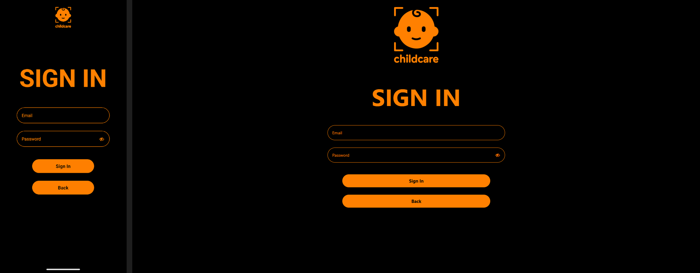
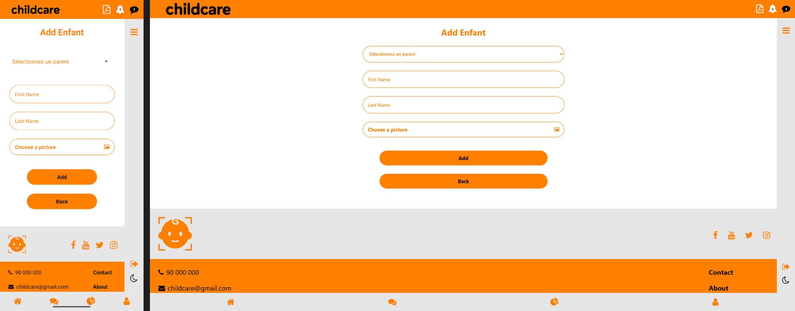
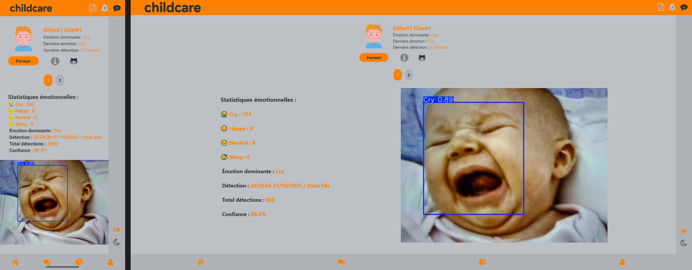
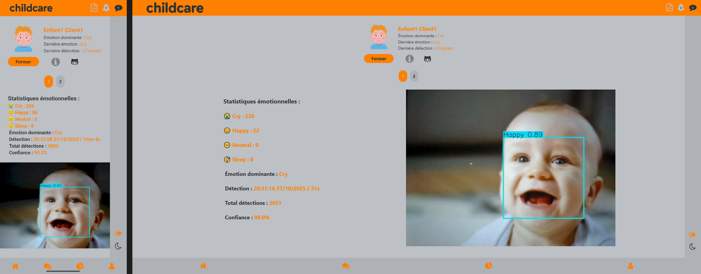
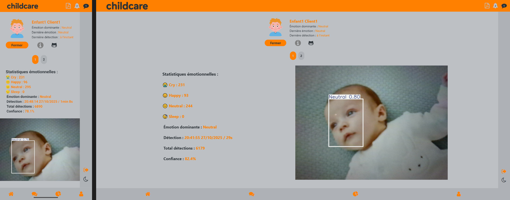
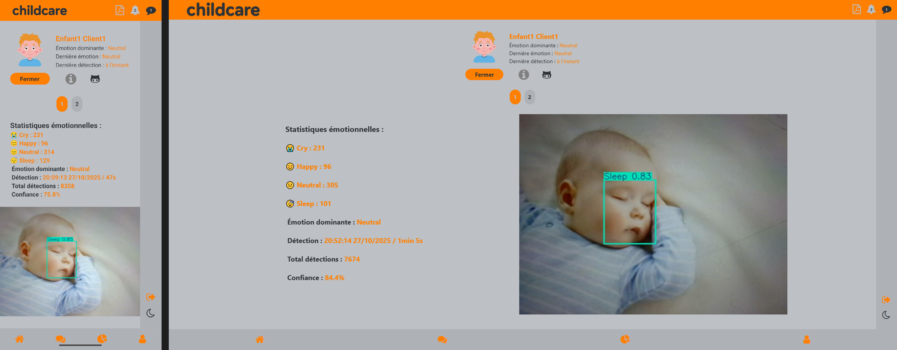
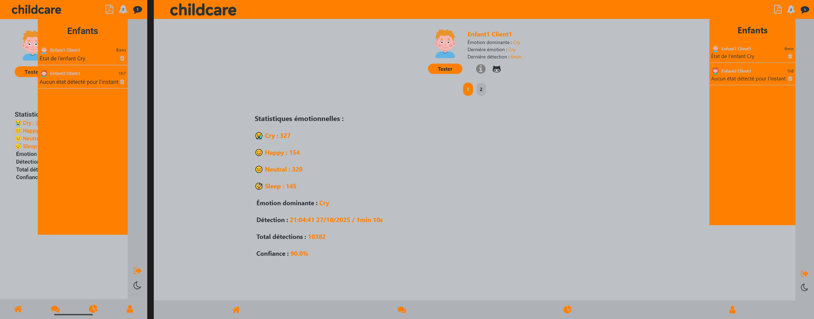
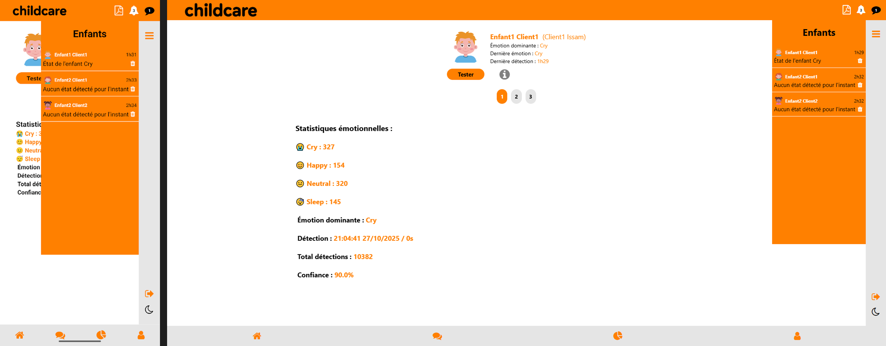
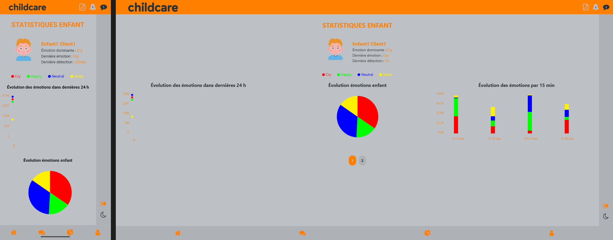
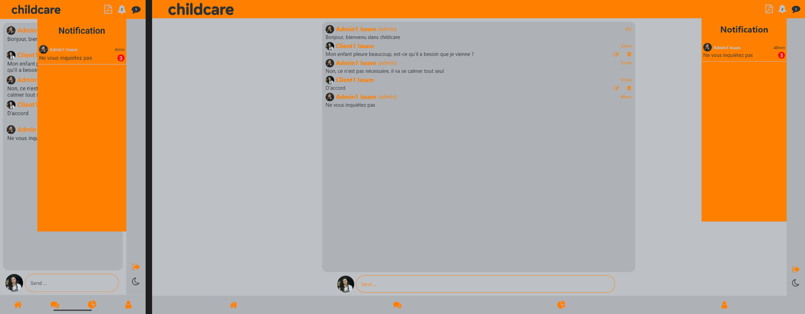
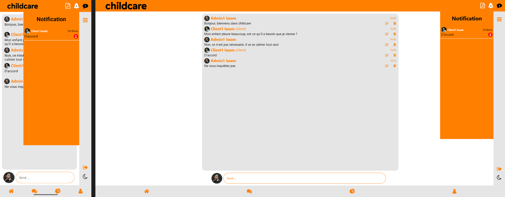

- IDE  
https://img.shields.io/badge/VS%20Code-1.90.2-blue?style=for-the-badge&logo=vscode&logoColor=white

- FRAMEWORK  

- LANGUAGE  

- TOOLS  

- DATABASE  

